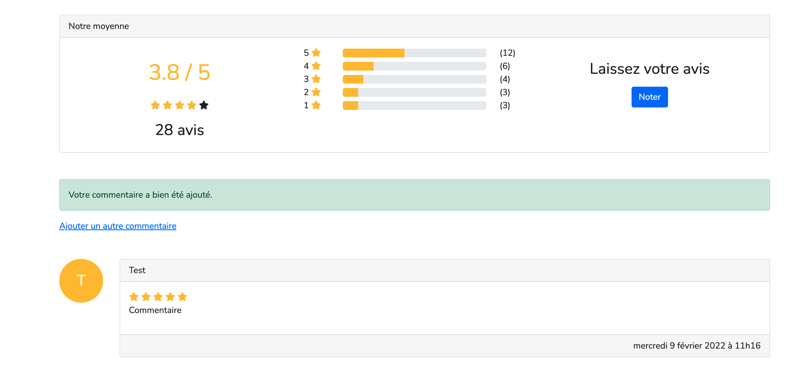
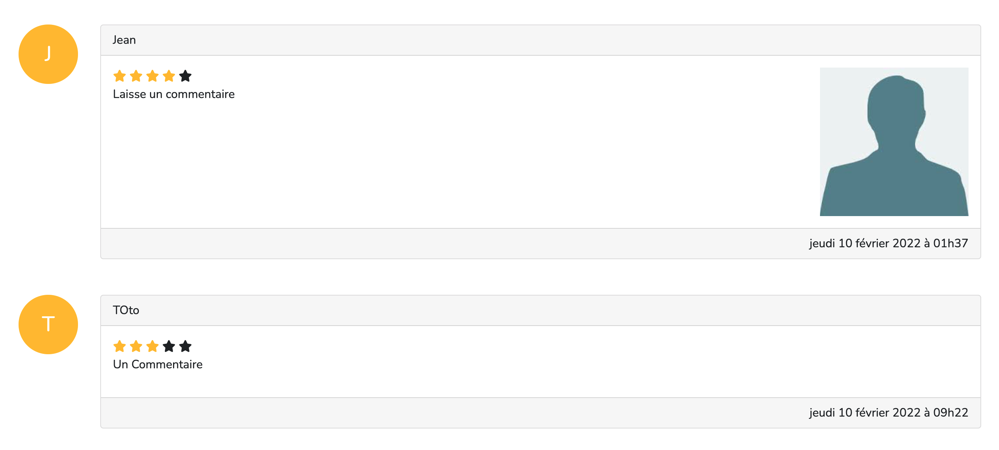

# Système d'avis en PHP

Nous allons construire un système d'avis en PHP. L'idée est de réaliser la page d'un restaurant avec la liste de ses avis.

## 1 - Intégration HTML / CSS

Pour le front, vous êtes libre d'utiliser ce que vous souhaitez, Bootstrap, Tailwind, sans framework, Scss... Cela doit juste ressembler au résultat final. On peut utiliser Font Awesome pour les petites étoiles (fas fa-star ) (https://cdnjs.cloudflare.com/ajax/libs/font-awesome/6.0.0/css/all.min.css).

Vous allez devoir donc intégrer le résultat suivant :


Concentrez-vous d'abord sur le front si vous préférez. De mon côté, j'ai utilisé Bootstrap avec des cards et des cols tout simplement (text-warning pour le jaune).

## 2 - Tableaux PHP

Pour commencer le PHP, il faudra créer un tableau PHP multidimensionnel (2 niveaux) contenant les avis :

- Nom
- Commentaire
- Note
- Date au format US (2022-02-09 11:43:12)

Il faudra lister les avis de manière dynamique :


On doit afficher la première lettre du nom dans l'avatar. On doit afficher le nombre d'étoiles par rapport à la note du commentaire.

Pour afficher la date correctement, il faudra sûrement regarder de [strtotime](https://www.php.net/manual/fr/function.strtotime.php) et [date](https://www.php.net/manual/fr/function.date). Les jours et les mois sont en français mais il y a possibilité de les traduire avec [notre meilleur ami](https://lucidar.me/fr/web-dev/in-php-how-to-display-date-in-french).

## 3 - Boucles PHP

Il faudra également utiliser les boucles et faire les bons calculs avec le tableau des avis pour que cette partie soit dynamique :


## 4 - Base de données

A cette étape, vous avez un bon résultat, et vous allez pouvoir stocker les commentaires dans une table d'une base de données. On va donc créer la table reviews avec :

- id (INT)
- name (VARCHAR)
- review (TEXT)
- note (INT)
- created_at (DATETIME ou TIMESTAMP)

Vous pouvez donc stocker les commentaires de votre tableau PHP dans la base de données et remplacer le tableau PHP par une requête SQL. N'oubliez pas PDO évidemment.

## 5 - Formulaire PHP

Vous devez maintenant faire fonctionner le formulaire afin de pouvoir ajouter un commentaire dans la base de données. Il faudra bien sûr vérifier les erreurs :


Si le formulaire est correctement rempli, on ajoute le commentaire dans la base de données et on affiche un message de succès. On prendra également soin de masquer le formulaire en mettant un lien pour rediriger vers la page index.php pour pouvoir ajouter à nouveau un commentaire.



## 6 - Upload

On va ajouter la possibilité pour les utilisateurs d'ajouter une photo en plus de leur avis. Il faudra donc modifier le formulaire pour ajouter un fichier (une image de 2mo maximum). La photo n'est pas obligatoire.


On ajoutera également une nouvelle colonne `image` de type `VARCHAR` (`null`) sur la table reviews car il faudra stocker le chemin de l'image afin de l'afficher facilement. Par exemple, on afficera l'image comme ceci :

```html

```

On devra stocker le chemin `uploads/review-123456.jpg` dans la colonne `image` au moment de l'`insert`.



## 7 - Sessions

On va ajouter une partie session sur le projet. On ajoutera un lien pour se connecter en haut à droite de la page.


Le lien aménera vers une nouvelle page login.php qui se contentera d'ajouter un prénom dans la session. On redirige ensuite directement sur la page `index.php`. Ce n'est pas un formulaire, ajoutez simplement le prénom dans la session, au plus simple.

Sur la page `index.php`, on va maintenant pouvoir vérifier si un prénom est présent dans la session, si c'est le cas, on affichera ce prénom avec un avatar en haut à droite à la place du nouveau lien.


On pré-remplira également le champ prénom quand l'utilisateur essaye d'ajouter un commentaire (voir l'attribut readonly).


On ajoutera ensuite un lien logout.php au clic sur l'avatar. Sur cette page, on se contentera de supprimer le prénom de la session puis de rediriger à nouveau vers `index.php`.

## 8 - Relations entre tables

Nous allons créer une nouvelle table `restaurants`. Elle contiendra le nom du restaurant ainsi qu'une image.

Nous allons renommer la page `index.php` en `avis.php`. Nous allons créer une nouvelle page `index.php` et afficher la liste des restaurants.


Au clic sur un restaurant, on se rendra sur la page `avis.php` mais il faudra qu'on ajoute l'id du restaurant dans l'URL comme `avis.php?id=5` pour voir les avis du restaurant 5 (Ne fonctionne pas pour l'instant mais ce n'est pas grave).

Une fois ceci fait, nous allons ajouter une nouvelle colonne `restaurant_id` sur la table `reviews`. Vous l'avez compris, on va stocker l'id du restaurant qui a reçu l'avis dans cette colonne, ce qui nous permettra de distinguer les avis de tous les restaurants.

On va maintenant pouvoir modifier la page `avis.php` afin de récupèrer l'id dans l'URL et adapter chaque requête SQL (récupèration des avis et insertion de l'avis) afin de lier les commentaires de cette page au restaurant en question ! On pourra également dynamiser le titre de la page et afficher l'image du restaurant.

## 9 - Bonus

Ajouter la possibilité de supprimer un commentaire. On ajoutera un bouton "Supprimer" pour chaque commentaire qui enverra vers une page pour supprimera et nous redirigera vers la liste des commentaires ensuite.

On ajoutera également un bouton modifier pour chaque commentaire. On clique sur le bouton, un paramètre "?comment=1" se rajoute à l'URL par exemple. On sait donc que le commentaire avec l'id 1 doit être modifié. A son emplacement, on remplacera le texte par un textarea contenant le texte puis un select pour la note. On pourra donc modifier ces valeurs et cliquer sur un bouton pour valider les changements et faire un UPDATE en BDD.
